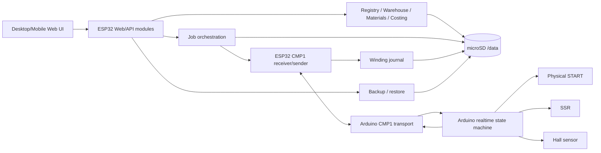

# CoilMaster — project map for AI agents

This document answers: **what exists, who owns it, where it lives, and where a change enters the runtime.**

## 1. Top-level map

```text
CoilMaster/
├─ Core/                         Arduino realtime/domain state logic
├─ Arduino/                      Arduino hardware adapters + CMP1 transport
│  └─ Config/                    Arduino pins/features/version
├─ firmware/
│  ├─ arduino/src/main.cpp       production Arduino composition root
│  └─ esp32/
│     ├─ src/                    production ESP32 C++ modules
│     └─ web/
│        ├─ desktop/             desktop UI
│        ├─ mobile/              mobile UI
│        └─ shared/              shared browser JS/assets
├─ Shared/
│  ├─ CMP1Text/                  production shared CMP1 CRC helper
│  └─ Protocol/                  old binary CMP, host-test-only
├─ Tests/
│  ├─ Protocol/                  host protocol/integration tests
│  ├─ CMP1Text/                  shared text-CRC tests
│  └─ Web/                       browser/static contract audits
├─ Engineering/Hardware/         hardware reference material
├─ docs/
│  ├─ AI_AGENT/                  fast maintenance map for agents
│  └─ PROJECT_HANDOFF/           release/project history and checkpoints
├─ platformio.ini                authoritative production build boundaries
└─ ARCHITECTURE.md               concise architectural summary
```

`platformio.ini` is authoritative for what is actually compiled.

## 2. Runtime ownership map



### Rule of ownership

- Arduino owns physical movement and realtime safety.
- ESP32 owns data/service/UI orchestration.
- Web code never owns physical outputs.
- Cross-board behavior is a protocol contract and must be changed on both sides when the wire contract changes.

## 3. Arduino subsystem map

### Composition root

```text
firmware/arduino/src/main.cpp
```

Inspect this first when adding/removing an Arduino runtime object, changing lifecycle calls or wiring a new hardware adapter into the production loop.

### Realtime/domain logic

```text
Core/
```

Use for machine state/input behavior that should not be tied directly to a hardware library.

### Hardware adapters

```text
Arduino/CM_DebouncedButton.*
Arduino/CM_HallTurnSource.*
Arduino/CM_SsrController.*
Arduino/CM_Lcd1602View.*
Arduino/CM_Buzzer*.h/.cpp
Arduino/CM_UartEventTransport.*
```

### Pin authority

```text
Arduino/Config/CM_Pins.h
```

Known fixed functions:

```text
D2–D9   keypad
D10     physical START
D11     buzzer
D12     SSR
A0      Hall
A1      Arduino TX → ESP32 RX
A2      Arduino RX ← ESP32 TX
```

Do not repurpose these pins without a hardware migration decision.

## 4. ESP32 subsystem map

### Main composition root

```text
firmware/esp32/src/main.cpp
```

It owns or connects major services including:

- `UartEventReceiver`
- `WindingJournal`
- persistent ID allocator
- job snapshot/state/spool-selection stores
- job linkage resolver
- warehouse
- workshop registry
- autonomous winding archive
- remote backup settings/web
- RTC
- network profile store/manager/web
- web recovery FTP
- static site server
- motor similarity

If a new top-level service needs a singleton-like lifetime for the whole device, inspect `main.cpp` first.

### Web/static composition root

```text
firmware/esp32/src/CM_StaticSiteServer.h/.cpp
```

This owns static `/web` serving and some HTTP helper modules such as winding history and read-only storage diagnostics. If an HTTP feature logically belongs to the site/system layer rather than the job orchestration root, inspect this class.

## 5. Major ESP32 domains

| Domain | First files to inspect | Responsibility |
|---|---|---|
| UART/job delivery | `CM_UartEventReceiver.*`, `main.cpp` | CMP1 job delivery, ACK/NACK/event handling |
| Winding journal | `CM_WindingJournal.*`, `CM_WindingJournalQuery*`, `CM_WindingJournalWeb.*` | persisted RUN_STARTED/RUN_COMPLETED history and validation |
| Job identity/state | `CM_PersistentIdAllocator.*`, `CM_JobSnapshotStore.*`, `CM_JobStateStore.*` | immutable identity/snapshot/state persistence |
| Exact spool selection | `CM_JobSpoolSelectionStore.*`, `CM_JobSpoolSelectionWeb.*` | exact spool bound to winding session |
| Job linkage | `CM_JobLinkageRequest.*`, `CM_JobLinkageResolver.*` | repair/motor/spool linkage before winding |
| Recovery | `CM_JobRecovery.*`, `CM_JobDisplayRecovery.*` | post-reboot state evaluation; no auto-resume |
| Workshop registry | `CM_RepairRegistry.*`, `CM_RepairRegistryWeb.*`, `CM_MotorSimilarityWeb.*` | clients, motors, repairs, lookup/import/similarity |
| Warehouse | `CM_Warehouse*.h/.cpp` | wire spools, pricing, movements, exact-run writeoff |
| Materials | `CM_Material*.h/.cpp` | auxiliary materials, usage, adjustments, historical line cost |
| Costing/pricing | `CM_RepairCosting*.h/.cpp`, `CM_RepairPricing*.h/.cpp` | repair cost/final pricing and persisted historical values |
| Backup/integrity | `CM_Backup*.h/.cpp`, `CM_RemoteBackup*.h/.cpp`, persistence integrity audit classes | read-only audit, remote backup, staged restore, rollback, transactional apply |
| Network | `CM_NetworkProfileStore.*`, `CM_NetworkManager.*`, `CM_NetworkWeb.*` | AP/STA profiles and bounded network management |
| Web recovery FTP | `CM_WebRecoveryFtpServer.*` | restricted upload path for `/web`, not `/data` |
| RTC/time | `CM_RtcClock.*` plus time API registration | DS3231/system time support |
| Storage diagnostics | `CM_StorageDiagnosticsWeb.*` | read-only card capacity/used/free diagnostics |
| Static web | `CM_StaticSiteServer.*` | `/web` entry routes, static assets, selected system APIs |
| Autonomous archive | `CM_AutonomousWindingArchive*`, `CM_AutonomousWindingWeb.*` | local winding archive/reporting domain |

The table is a navigation aid. Always fetch the current matching files before editing.

## 6. Production CMP1 protocol map

Production text protocol:

```text
Arduino/CM_UartEventTransport.h/.cpp
firmware/esp32/src/CM_UartEventReceiver.h/.cpp
Shared/CMP1Text/CM_Cmp1Crc.h
```

Current conceptual directions:

```text
ESP32 → Arduino: JOB / cancel-related delivery
Arduino → ESP32: JOB_ACK / RUN_STARTED / RUN_COMPLETED
ESP32 → Arduino: event ACK/NACK
```

CRC: CRC-16/MODBUS, shared by `Shared/CMP1Text/CM_Cmp1Crc.h`.

Do not confuse with:

```text
Shared/Protocol/
```

which is the older binary CMP (`0xAA55`, binary header, CRC-CCITT) and is not in the production PlatformIO source filter.

## 7. Data map

Authoritative runtime data is under microSD `/data`; web assets are under `/web`.

Known important areas:

```text
/data/workshop/                        clients/motors/repairs/status
/data/winding-runs/events.ndjson       winding event journal
/data/winding-jobs/                    ID state, snapshots, spool selections, job state
/data/materials/                       material catalogue/usage/adjustments
```

Warehouse, pricing, backup metadata and other domains are also persisted under `/data` through their owning modules.

### Persistence change rule

When adding a new persisted field/file/domain, inspect all of these concerns:

1. writer/append path;
2. authoritative reader;
3. syntax/schema validation;
4. backward compatibility with existing records;
5. integrity audit;
6. reference/cross-identity validation;
7. backup/export inclusion;
8. restore/rollback handling if the path is production data;
9. API/UI representation;
10. tests.

Never add a production data file that backup/integrity logic does not know exists.

## 8. API/UI map

### API implementation pattern

Most HTTP domains use a `*Web` class that receives a `WebServer&` and domain dependencies, then registers routes during initialization.

Common places to inspect for ownership/registration:

```text
firmware/esp32/src/main.cpp
firmware/esp32/src/CM_StaticSiteServer.h/.cpp
```

### UI locations

```text
firmware/esp32/web/desktop/
firmware/esp32/web/mobile/
firmware/esp32/web/shared/
```

Default rule: substantial operator functionality should exist in both desktop and mobile variants, with shared JS used where appropriate.

### Motor import

```text
docs/MOTOR_IMPORT_FORMAT.md
firmware/esp32/web/desktop/motor-import.html
firmware/esp32/web/mobile/motor-import.html
CM_RepairRegistryWeb.*
CM_MotorSimilarityWeb.*
```

## 9. Backup/restore safety map

The backup/restore subsystem is safety-sensitive because it can replace production data.

Start with:

```text
CM_BackupActivityGuard.*
CM_BackupExportWeb.*
CM_RemoteBackupSettings.*
CM_RemoteBackupTransfer.*
CM_RemoteBackupWeb.*
CM_BackupBusinessDataIntegrityAudit.*
CM_WorkshopPersistenceIntegrityAudit.*
CM_MaterialPersistenceIntegrityAudit.*
CM_WarehousePersistenceIntegrityAudit.*
CM_WindingPersistenceIntegrityAudit.*
CM_WindingSessionPersistenceIntegrityAudit.*
```

Required semantics include safe-idle gating, strict validation, rollback snapshot, explicit operator APPLY, persisted stale evidence and no automatic continuation after reboot.

Do not simplify this subsystem by bypassing a preflight or stale-evidence check.

## 10. Build/test map

```text
platformio.ini
.github/workflows/arduino-uno-build.yml
.github/workflows/esp32-build.yml
.github/workflows/cmp-protocol-tests.yml
Tests/Protocol/
Tests/CMP1Text/
Tests/Web/
```

Exact verification routing is in `04_VERIFICATION_MATRIX.md`.

## 11. Hardware map

ESP32 fixed connections documented by the project:

```text
UART2 RX GPIO16
UART2 TX GPIO17
microSD CS GPIO5
microSD SCK GPIO18
microSD MISO GPIO19
microSD MOSI GPIO23
RTC SDA GPIO21
RTC SCL GPIO22
```

Arduino↔ESP32 UART uses a bidirectional level shifter and common signal ground.

Power and hardware safety details live in:

```text
docs/PROJECT_HANDOFF/02_ARCHITECTURE_AND_HARDWARE.md
```

## 12. Ownership rule for future modules

Every new module must have one explicit owner:

```text
Arduino main
ESP32 main
StaticSiteServer
or another clearly documented parent service
```

The owner must answer:

- who constructs it;
- who calls `begin()`/initialization;
- who calls `loop()`/`tick()` if needed;
- what dependencies are injected;
- what happens when initialization fails;
- what persistent files/routes it owns;
- what tests protect its contract.

If these answers are unclear, the module is not ready to be integrated.
